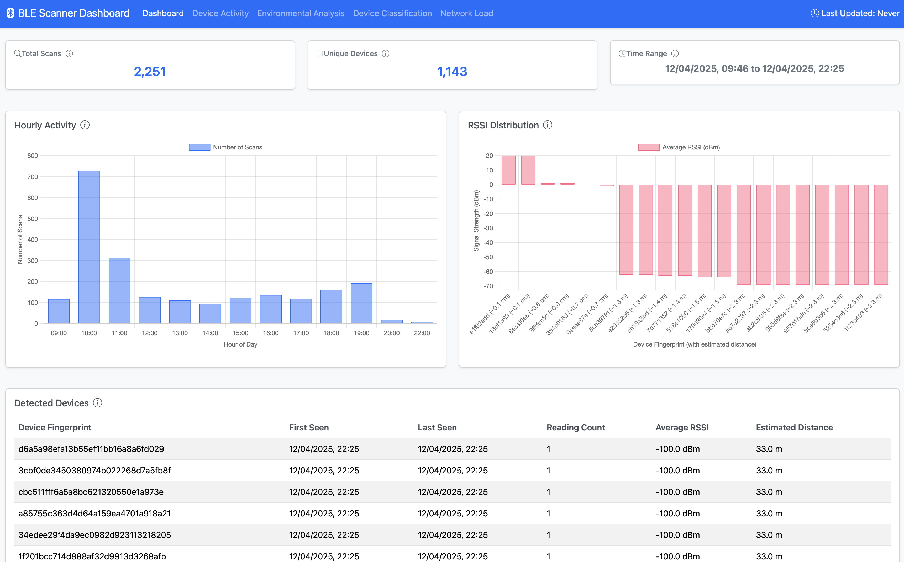
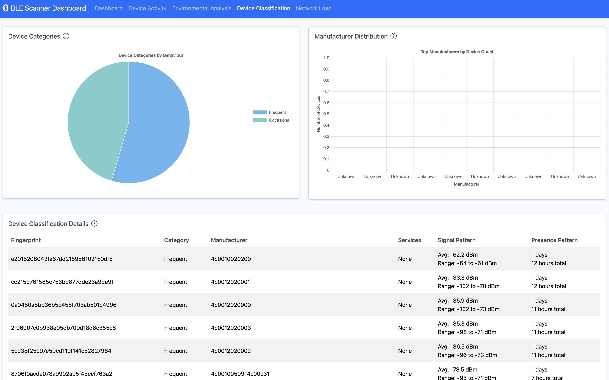

# BLE Scanner Dashboard

## Overview
A real-time dashboard for visualising and analysing Bluetooth Low Energy (BLE) scanner data. This application provides comprehensive insights into BLE device activities, environmental factors, and network patterns. The app can be used to gain insights from visitor traffic at conferences and exhibitions.

This dashboard is associated with the parallel BLE scanner app, see https://github.com/rendzina/ble_scanner

Created: 14/Apr/2025
Last Updated: 14/Apr/2025



## Features

### Real-time Monitoring
- Live device detection and tracking
- Signal strength monitoring
- Activity pattern analysis
- Network load visualisation

### Statistical Analysis
- Device presence patterns
- Signal propagation analysis
- Channel utilisation metrics
- Device classification

### Visualisations
- Interactive charts and graphs
- Real-time data updates
- Customisable time ranges
- Multi-metric comparisons

## Technical Stack

### Frontend
- HTML5/CSS3
- JavaScript (ES6+)
- Bootstrap 5.3.2
- Chart.js 4.4.1
- Bootstrap Icons

### Backend
- Node.js
- Express.js
- SQLite3
- RESTful API

## Installation

### Prerequisites
- Node.js (>= 18.0.0)
- npm (Node Package Manager)
- SQLite3



### Setup
1. Clone the repository:
```bash
git clone github.com/rendzina/ble_scanner_dashboard
cd ble_scanner_dashboard
```

2. Install dependencies:
```bash
npm install
```

3. Configure the environment:
```bash
cp .env.example .env
# Edit .env with your configurations
```

4. Database
It is assumed the SQLite database is held remotely in the seperate folder
of the ble_scanner app (see https://github.com/rendzina/ble_scanner). The
index.js file here (line 38) can be adjusted with the location. Alternatively, a softlink can be made from the remote database, and
permissions set accordingly, thus:
```bash
ln -s /remote folder of ble_scanner/db_scans.db db_scans.db
sudo usermod -a -G admin www-data       [may be required]
sudo chmod 664 ble_scans.db             [may be required]
```

5. Start the server:
```bash
npm start
```

The application will be available at `http://localhost:8080`

## Project Structure
```text
ble_scanner_dashboard/
├── public/ # Static files directory
│ ├── css/ # Stylesheet files
│ │ └── style.css # Main stylesheet
│ ├── js/ # Client-side JavaScript
│ │ ├── dashboard.js # Main dashboard functionality
│ │ ├── device-activity.js # Device activity charts and analysis
│ │ ├── device-types.js # Device classification visualisations
│ │ ├── environment-stats.js # Environmental analysis charts
│ │ └── network-stats.js # Network statistics visualisations
│ └── html/ # HTML pages
│ ├── index.html # Main dashboard page
│ ├── device-activity.html # Device activity analysis page
│ ├── device-types.html # Device classification page
│ ├── environment-stats.html # Environmental analysis page
│ └── network-stats.html # Network statistics page
│
├── server/ # Server-side code
│ ├── app.js # Express application configuration
│ ├── index.js # Server entry point
│ └── stats.js # Statistical analysis router
│
├── database/ # Database related files
│ └── ble_scans.db # SQLite database file
│
├── node_modules/ # Node.js dependencies (git-ignored)
│
├── .gitignore # Git ignore configuration
├── package.json # Project metadata and dependencies
├── package-lock.json # Dependency lock file
└── README.md # Project documentation
```

### Key Components

#### Frontend (`/public`)
- **CSS (`/css`)**
  - `style.css`: Global styles, chart containers, and UI components

- **JavaScript (`/js`)**
  - `dashboard.js`: Main dashboard functionality and real-time updates
  - `device-activity.js`: Device activity pattern visualisations
  - `device-types.js`: Device classification and categorisation
  - `environment-stats.js`: Environmental analysis charts
  - `network-stats.js`: Network load and utilisation metrics

- **HTML Pages**
  - `index.html`: Main dashboard interface
  - `device-activity.html`: Device temporal analysis
  - `device-types.html`: Device classification interface
  - `environment-stats.html`: Environmental analysis page
  - `network-stats.html`: Network statistics interface

#### Backend (`/server`)
- `app.js`: Express application setup and middleware configuration
- `index.js`: Server entry point and main configuration
- `stats.js`: Statistical analysis and API endpoint implementations

#### Database (`/database`)
- `ble_scans.db`: SQLite database containing BLE scan records. Can be a softlink to the actual location.

#### Configuration Files
- `.gitignore`: Specifies which files Git should ignore
- `package.json`: Project metadata and dependency specifications
- `README.md`: Project documentation and setup instructions

### File Responsibilities

#### Frontend Files
- Handle data visualisation using Chart.js
- Manage user interface interactions
- Process and display real-time updates
- Implement responsive design

#### Backend Files
- Manage database connections
- Process BLE scan data
- Provide RESTful API endpoints
- Handle error conditions

#### Database
- Store BLE scan records
- Maintain device fingerprints
- Track signal strengths
- Store manufacturer data